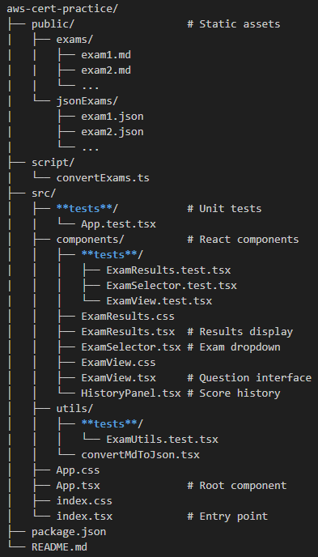

# 📚 AWS Certification Practice App


A responsive web application for practicing AWS certification exams with persistent score tracking.

## ✨ Features

- **Exam Simulation**
  - 23+ AWS practice exams
  - Timed exam environment
  - Instant scoring

- **Progress Tracking**
  - Exam history saved in browser
  - Score percentage visualization
  - Date-stamped attempts

- **User Experience**
  - Clean, intuitive interface
  - Mobile-responsive design
  - Exam restart capability

## 🛠️ Technologies

- **Frontend**
  - React 18 (TypeScript)
  - CSS Modules for styling
  - LocalStorage API for persistence

- **Testing**
  - Jest + React Testing Library
  - Test coverage reporting

- **Tooling**
  - Vite (or Create-React-App)
  - Prettier + ESLint

## 🚀 Getting Started

### Prerequisites

- Node.js v16+
- npm v8+

### Installation

1. Clone the repository:

   ```bash
   git clone https://github.com/your-username/aws-cert-practice.git
   cd aws-cert-practice

2. Install dependencies:

    ```bash
    npm install

3. Convert exam data (if needed):

    ```bash
    npm run convert:exams

4. Running the App

    ```bash
    npm start

5. Open <http://localhost:3000> in your browser.

## 📂 Project Structure



## 🧪 Testing

- Run all tests

    ```bash
    npm test

- Run tests in watch mode

    ```bash
    npm run test:watch

- Generate coverage report:

    ```bash
    npm run test:coverage

## 🛠️ Build for Production

    ```bash
    npm run build

## 🤝 Contributing

1. Fork the project
2. Create your feature branch (git checkout -b feature/AmazingFeature)
3. Commit your changes (git commit -m 'Add some amazing feature')
4. Push to the branch (git push origin feature/AmazingFeature)
5. Open a Pull Request

## 📜 License

Distributed under the MIT License. See LICENSE for more information.

## ✉️ Contact

- Francisco Bejarano Escano - <francisco.escano@2itesting.com>
- Project Link: <https://github.com/FranEscano/AWS_MockExams_App.git>
